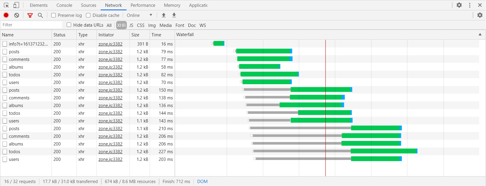
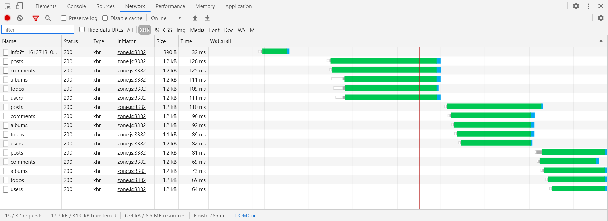

## DataHttpClient

Custom http client, with the ability to customize requests, auto unsubscribe and additional request interceptors.

## Table of contents:

1. [📖 Changelog](https://github.com/Angular-RU/sdk/blob/master/CHANGELOG.md)
2. [📦 Advanced](#table-of-contents)
   - [@angular-ru/cdk/http/utils](https://github.com/Angular-RU/sdk/blob/master/libs/http/docs/utils.md)
   - [@angular-ru/cdk/http/decorators](https://github.com/Angular-RU/sdk/blob/master/libs/http/docs/decorators.md)

#### First step

Example, if your API base url placed here `https://my-server.com/api/***` and have swagger documentation:


```typescript
import {provideHttpClient} from '@angular/common/http';
import {provideDataHttpClientOptions} from '@angular-ru/cdk/http';

export const appConfig: ApplicationConfig = {
  providers: [
    provideHttpClient(),
    provideDataHttpClientOptions([ApiUsersClient], {
      hostUrl: 'https://my-server.com/api/',
    }),
  ],
};
```

#### Create your http client for your api controller

- `user.interface.ts`

```typescript
export interface User {
  id: number;
  name: string;
}
```

- `api-users.client.ts`

```typescript
import {Delete, Get, Patch, PathVariable, RequestBody, Put, RestClient} from '@angular-ru/cdk/http/decorators';
import {DataHttpClient} from '@angular-ru/cdk/http';
import {Injectable} from '@angular/core';
import {Observable} from 'rxjs';

@Injectable()
@RestClient('/users')
export class ApiUsersClient extends DataHttpClient {
  @Get()
  public findAllUsers(): Observable<User[]> {
    return this.restTemplate();
  }

  @Post()
  public createUser(@RequestBody() _body: User): Observable<void> {
    return this.restTemplate();
  }

  @Get('/{id}')
  public findByIdUser(@PathVariable('id') _id: number): Observable<User> {
    return this.restTemplate();
  }

  @Put('/{id}')
  public updateUser(@PathVariable('id') _id: number, @RequestBody() _body: User): Observable<void> {
    return this.restTemplate();
  }

  @Delete('/{id}')
  public deleteByIdUser(@PathVariable('id') _id: number): Observable<void> {
    return this.restTemplate();
  }

  @Patch('/{id}')
  public mutateUser(@PathVariable('id') _id: number, @RequestBody() _body: Partial<User>): Observable<void> {
    return this.restTemplate();
  }
}
```

- `app.component.ts`

```typescript
@Component({
  //...
  changeDetection: ChangeDetectionStrategy.OnPush,
})
export class UsersComponent {
  private readonly users: User[] = [];

  constructor(
    private readonly users: ApiUsersClient,
    private readonly cd: ChangeDetectorRef,
  ) {}

  public ngOnInit(): void {
    this.users.findAllUsers().subscribe((users) => {
      this.users = users;
      this.cd.detectChanges();
    });
  }
}
```

#### Different use cases

each of these examples works the same

```typescript
@Injectable()
@RestClient('/cities')
class MyCitiesClient extends DataHttpClient {
  @Put()
  public updateCity(@RequestBody() _body: CityRecordDto, @RequestParam('id') _id: number): Observable<void> {
    return this.restTemplate({emitSuccess: true});
  }
}
```

```typescript
@Injectable()
@RestClient('/cities')
class MyCitiesClient extends DataHttpClient {
  @Put()
  public updateCity(body: CityRecordDto, id: number): Observable<void> {
    return this.restTemplate({emitSuccess: true, body, queryParams: {id}});
  }
}
```

```typescript
@Injectable()
@RestClient('/cities')
class MyCitiesClient extends DataHttpClient {
  public updateCity(body: CityRecordDto, id: number): Observable<void> {
    return this.put({emitSuccess: true, body, queryParams: {id}});
  }
}
```

#### Limiting the number of concurrent requests (optional)

| Option           | Value    | Description     |
| :--------------- | :------- | :-------------- |
| limitConcurrency | 255      | default         |
| limitConcurrency | Infinity | no limits       |
| limitConcurrency | n        | only n requests |

there is almost no limit on the number of requests that can be sent in parallel <br> Note: various browsers have various
limits for maximum connections per host name (Chrome: 6)



but if necessary, you can change it <br> for example, <b>limitConcurrency: 5</b> <br> This mean that maximum of 5
requests can be executed in parallel. Next one immediately start only if one of the previous requests is completed

- `app.config.ts`

```typescript
import {provideHttpClient} from '@angular/common/http';
import {provideDataHttpClientOptions} from '@angular-ru/cdk/http';

export const appConfig: ApplicationConfig = {
  providers: [
    provideHttpClient(),
    provideDataHttpClientOptions([ApiUsersClient], {
      // ...
      limitConcurrency: 5,
    }),
  ],
};
```



#### `@angular-ru/cdk/http/decorators`

- `@RestClient(url)`

```typescript
@Injectable()
@RestClient('my-controller-api-path')
export class ApiEtcClient extends DataHttpClient {}
```

- `@BaseUrl(url)`

```typescript
@Injectable()
@BaseUrl('nginx-path-controller')
@RestClient('my-controller-api-path')
export class ApiEtcClient extends DataHttpClient {}
```

- `@HostUrl(url)`

```typescript
@Injectable()
@HostUrl('//no-cors.my-api.com')
@BaseUrl('nginx-path-controller')
@RestClient('my-controller-api-path')
export class ApiEtcClient extends DataHttpClient {}
```

- `@Get(url), @Post(url), @Put(url), @Delete(url), @Patch(url)`

```typescript
@Injectable()
@RestClient('users')
export class ApiUsersClient extends DataHttpClient {
  @Get()
  public getUsersAll(): Observable<User[]> {
    return this.restTemplate();
  }
}
```

- `@RequestParam(key)`

```typescript
@Injectable()
@RestClient('users')
export class ApiUsersClient extends DataHttpClient {
  @Get()
  public getUsersAllByPagination(
    @RequestParam('size') _pageSize: number,
    @RequestParam('index') _pageIndex: number,
  ): Observable<User[]> {
    return this.restTemplate();
  }

  // ...
}
```

- `@PathVariable(key)`

```typescript
@Injectable()
@RestClient('users')
export class ApiUsersClient extends DataHttpClient {
  @Get('/{id}')
  public getUserById(@PathVariable('id') _userId: number): Observable<User> {
    return this.restTemplate();
  }
}
```

- `@RequestBody()`

```typescript
@Injectable()
@RestClient('users')
export class ApiUsersClient extends DataHttpClient {
  @Post()
  public createUser(@RequestBody() _body: User): Observable<User> {
    return this.restTemplate();
  }
}
```

#### `@angular-ru/cdk/http/utils`

- `isLocalhost`

```typescript
expect(isLocalhost('https://127.0.0.1:4200')).toEqual(true);
expect(isLocalhost('https://google.com')).toEqual(false);
```

- `getPathWithoutQueryParams`

```typescript
expect(getPathWithoutQueryParams('http://hello/world/todo/1/all?pageSize=10&pageIndex=0')).toEqual(
  'http://hello/world/todo/1/all',
);
```

- `getUrlSegments`

```typescript
expect(getUrlSegments({})).toEqual({hostUrl: 'http://localhost/', baseUrl: ''});
expect(getUrlSegments({hostUrl: 'http://hello_world', baseUrl: 'api'})).toEqual({
  hostUrl: 'http://hello_world/',
  baseUrl: '/api/',
});
```

- `isAbsolutePath`

```typescript
expect(isAbsolutePath('/api')).toEqual(false);
expect(isAbsolutePath('//hello_world')).toEqual(false);
expect(isAbsolutePath('http://hello_world')).toEqual(true);
```

- `replaceDoubleSlash`

```typescript
expect(replaceDoubleSlash('https://a///b//c/d/')).toEqual('https://a/b/c/d/');
expect(replaceDoubleSlash('////a///b//c/d/')).toEqual('/a/b/c/d/');
```

- `replaceLeadingAndTrailingSlashes`

```typescript
expect(replaceLeadingAndTrailingSlashes('/')).toEqual('');
expect(replaceLeadingAndTrailingSlashes('//')).toEqual('');
expect(replaceLeadingAndTrailingSlashes('//a///b//c/d/')).toEqual('a/b/c/d');
```

- `urlParse`

```typescript
expect(urlParse('////a///b//c/d?quick', getUrlSegments({hostUrl: 'https://127.0.0.0:8030'}))).toEqual(
  'https://127.0.0.0:8030/a/b/c/d',
);
```

- `getHttpHeader`

```typescript
const headers: HttpHeaders = getHttpHeader({a: '1', b: '2'});
expect(headers.keys()).toEqual(['a', 'b']);
expect(headers.get('a')).toEqual('1');
expect(headers.get('b')).toEqual('2');
```

- `parseQueryParams`

```typescript
const queryParams: PlainObject = parseQueryParams('/todos/get?pageSize=5&value=2');
expect(queryParams).toEqual({pageSize: '5', value: '2'});
```

- `getHttpParams`

```typescript
const params: HttpParams = getHttpParams('/todos/get?pageSize=5&value=2', {pageIndex: 0});
expect(params.keys()).toEqual(['pageSize', 'value', 'pageIndex']);
expect(params.get('pageSize')).toEqual('5');
expect(params.get('value')).toEqual('2');
expect(params.get('pageIndex')).toEqual(0);
```
