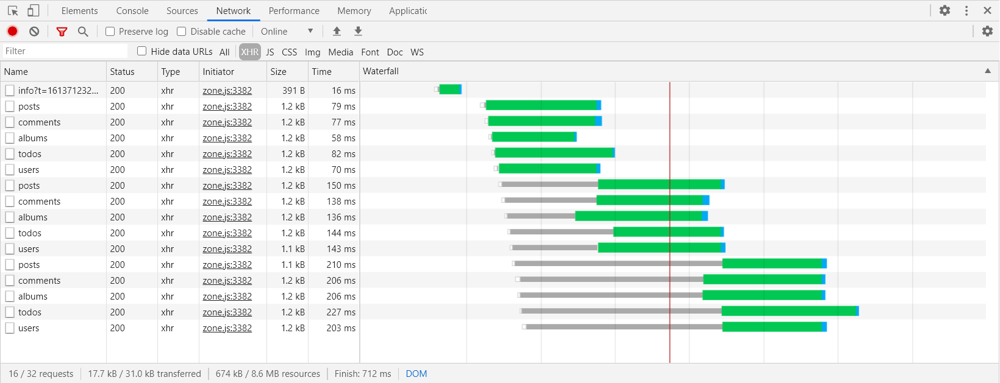
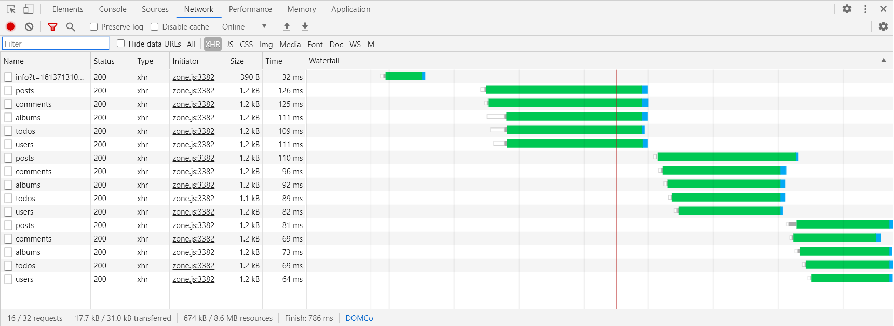

## DataHttpClientModule

Custom http client, with the ability to customize requests, auto unsubscribe and additional request interceptors.

## Table of contents:

1. [📖 Changelog](https://github.com/Angular-RU/angular-ru-sdk/blob/master/CHANGELOG.md)
2. [📦 Advanced](#table-of-contents)

    - [(@)angular-ru/http/utils](https://github.com/Angular-RU/angular-ru-sdk/blob/master/packages/http/docs/utils.md)
    - [(@)angular-ru/http/decorators](https://github.com/Angular-RU/angular-ru-sdk/blob/master/packages/http/docs/decorators.md)

#### First step

Example, if your API base url placed here `https://my-server.com/api/***` and have swagger documentation:


```ts
import { HttpClientModule } from '@angular/common/http';
import { DataHttpClientModule } from '@angular-ru/http';

@NgModule({
    imports: [
        // ...
        HttpClientModule,
        DataHttpClientModule.forRoot([ApiUsersClient], {
            hostUrl: 'https://my-server.com/api/'
        })
    ],
    declarations: [AppComponent],
    bootstrap: [AppComponent]
})
export class AppModule {}
```

#### Create your http client for your api controller

-   `user.interface.ts`

```ts
export interface User {
    id: number;
    name: string;
}
```

-   `api-users.client.ts`

```ts
import { Delete, Get, Patch, PathVariable, RequestBody, Put, RestClient } from '@angular-ru/http/decorators';
import { DataHttpClient } from '@angular-ru/http';
import { Injectable } from '@angular/core';
import { Observable } from 'rxjs';

@Injectable()
@RestClient('/users')
export class ApiUsersClient extends DataHttpClient {
    @Get()
    public findAllUsers(): Observable<User[]> {
        return this.restTemplate();
    }

    @Post()
    public createUser(@RequestBody() _body: User): Observable<void> {
        return this.restTemplate();
    }

    @Get('/{id}')
    public findByIdUser(@PathVariable('id') _id: number): Observable<User> {
        return this.restTemplate();
    }

    @Put('/{id}')
    public updateUser(@PathVariable('id') _id: number, @RequestBody() _body: User): Observable<void> {
        return this.restTemplate();
    }

    @Delete('/{id}')
    public deleteByIdUser(@PathVariable('id') _id: number): Observable<void> {
        return this.restTemplate();
    }

    @Patch('/{id}')
    public mutateUser(@PathVariable('id') _id: number, @RequestBody() _body: Partial<User>): Observable<void> {
        return this.restTemplate();
    }
}
```

-   `app.component.ts`

```ts
@Component({
    //...
    changeDetection: ChangeDetectionStrategy.OnPush
})
export class UsersComponent {
    private readonly users: User[] = [];

    constructor(private readonly users: ApiUsersClient, private readonly cd: ChangeDetectorRef) {}

    public ngOnInit(): void {
        this.users.findAllUsers().subscribe((users) => {
            this.users = users;
            this.cd.detectChanges();
        });
    }
}
```

#### Different use cases

each of these examples works the same

```ts
@Injectable()
@RestClient('/cities')
class MyCitiesClient extends DataHttpClient {
    @Put()
    public updateCity(@RequestBody() _body: CityRecordDto, @RequestParam('id') _id: number): Observable<void> {
        return this.restTemplate({ emitSuccess: true });
    }
}
```

```ts
@Injectable()
@RestClient('/cities')
class MyCitiesClient extends DataHttpClient {
    @Put()
    public updateCity(body: CityRecordDto, id: number): Observable<void> {
        return this.restTemplate({ emitSuccess: true, body, queryParams: { id } });
    }
}
```

```ts
@Injectable()
@RestClient('/cities')
class MyCitiesClient extends DataHttpClient {
    public updateCity(body: CityRecordDto, id: number): Observable<void> {
        return this.put({ emitSuccess: true, body, queryParams: { id } });
    }
}
```

#### Limiting the number of concurrent requests (optional)

|Option|Value|Description|
|:---|:---|:---|
|limitConcurrency|255|default|
|limitConcurrency|Infinity|no limits|
|limitConcurrency|n|only n requests|

there is almost no limit on the number of requests that can be sent in parallel
<br>
Note: various browsers have various limits for maximum connections per host name (Chrome: 6)



but if necessary, you can change it
<br>
for example, <b>limitConcurrency: 5</b>
<br>
This mean that maximum of 5 requests can be executed in parallel. Next one immediately start only if one of the previous requests is completed

-   `app.module.ts`

```ts
import { DataHttpClientModule } from '@angular-ru/http';

@NgModule({
    imports: [
        // ...
        DataHttpClientModule.forRoot([ApiUsersClient], {
            // ...
            limitConcurrency: 5
        })
    ]
    // ...
})
export class AppModule {}
```



